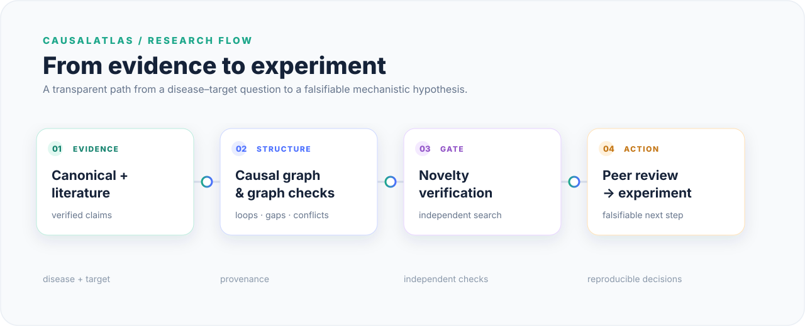
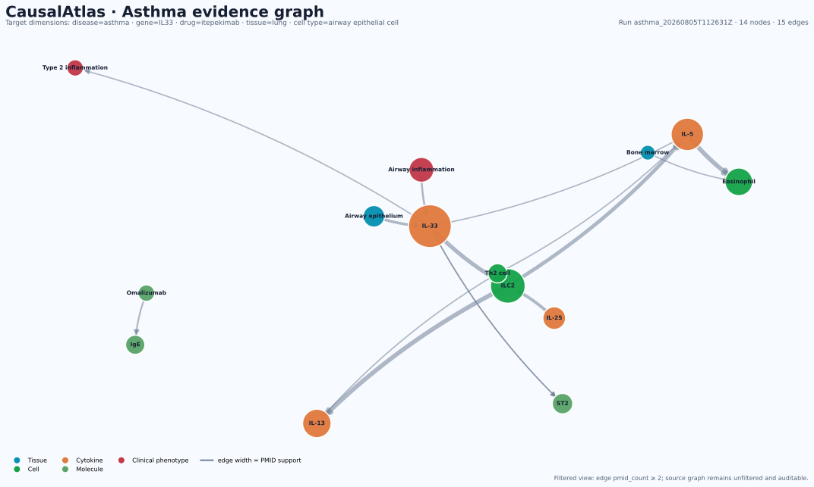

<div align="center">

<p><sub>BIOMEDICAL RESEARCH SOFTWARE · EVIDENCE-FIRST · SAFETY-GATED</sub></p>

# CausalAtlas

### From a disease–target question to a falsifiable experiment

<p>Auditable mechanistic reasoning for biomedical discovery — with every claim, conflict and decision left inspectable.</p>

<p>
  <a href="#start-here"></a>
  <a href="#offline-demo-no-backend"></a>
  <a href="docs/REPRODUCIBILITY.md"></a>
  <a href="#security"></a>
</p>

<table>
  <tr>
    <td><strong>INSPECT</strong><br />Evidence, provenance and contradictions stay visible.</td>
    <td><strong>VERIFY</strong><br />Novelty claims pass an independent search gate.</td>
    <td><strong>DESIGN</strong><br />Only checked candidates become experiments.</td>
  </tr>
</table>



<p>
  <strong>Workflow</strong><br />
  Disease + target → evidence trail → causal graph<br />
  → novelty gate → falsifiable experiment
</p>

<p><small><em>Research software, not medical advice.<br />A generated hypothesis is not a clinical or therapeutic recommendation.</em></small></p>

</div>

## Extension notice

This repository is a backward-compatible extension of the baseline CausalAtlas
disease-target implementation.

The current version adds multidimensional analysis targets, including drugs,
tissues, and cell types, while preserving the original `disease + gene` workflow
and existing session and graph artifacts.

The baseline implementation is preserved as Git tag `v0.2.0`. Check out that tag
when the original disease-target behavior is required.

For a wide live-run example with all optional target dimensions populated, see
[Showcase Runs](docs/SHOWCASE_RUNS.md).

For the full architecture, evidence rules, retrieval strategy, quality gates,
drug–gene evidence states, disease-free mode, artifacts, and presentation notes,
see [Architecture Deep Dive](docs/ARCHITECTURE_DEEP_DIVE.md).

## Version compatibility

The project remains one application; this extension is not a separate CausalAtlas
2.0 repository. The legacy request shape remains valid:

```json
{
  "disease": "asthma",
  "gene": "IL33"
}
```

New target dimensions are optional. Existing sessions, graphs, offline snapshots,
and API clients must remain readable throughout the extension.

## What is CausalAtlas?

CausalAtlas is a research platform for turning a biomedical question into an inspectable mechanistic argument. It is designed for the failure mode where an LLM produces a convincing biological story, but the story is already known, weakly sourced, or impossible to falsify.

Instead of returning one paragraph, CausalAtlas preserves the trail:

```text
disease + target
      ↓
canonical baseline → literature → verification → quality filter
      ↓                                      ↓
mechanistic extraction → causal knowledge graph
                              ↓
                 novelty gate → peer review → experiment design
```

The result is a set of inspectable artifacts: publications, directed edges, provenance, contradictions, novelty audits, reviewer decisions and experimental controls.

## Example evidence graph

This is a real run-scoped view from `asthma_20260805T112631Z`. It uses an
explicit `edge pmid_count ≥ 2` readability filter; the source graph remains
unfiltered and auditable. The visualization represents published evidence, not
biological truth.

<p align="center">
  
</p>

The export metadata and reproducible generator are kept alongside the image in
[`docs/assets/`](docs/assets/) and [`scripts/export_readme_graph.py`](scripts/export_readme_graph.py).

## Start here

There are three ways to use the project. Choose the one that matches your goal:

| Goal | Needs backend? | Needs model login? | Start here |
| --- | ---: | ---: | --- |
| See the interface and real stored graphs | No | No | [Standalone offline version](#offline-demo-no-backend) |
| Run the API and explore persisted data | Yes | No | [Full stack](#full-stack-with-docker) |
| Launch a new disease–target analysis | Yes | Yes | [Live analysis](#live-analysis-and-cli-authentication) |

### The fastest path: run the offline interface

The offline interface uses the same React UI as the main application and does not require FastAPI, Docker, a database, a CLI login or an API key.

## Offline demo — no backend

### Option 1: development server

```bash
cd frontend
npm ci
npm run dev
```

Open <http://localhost:5173/> for the full offline interface, or <http://localhost:5173/demo.html#/graphs> for the separate offline entry point.

### Option 2: static preview server

Use this when you want to inspect the demo exactly as it will behave on a static host:

```bash
cd frontend
nvm use                         # uses frontend/.nvmrc
npm ci
npm run build
npm run preview
```

If `nvm: command not found` appears on macOS, use Homebrew instead:

```bash
brew install node@22
export PATH="$(brew --prefix node@22)/bin:$PATH"
node --version                  # must be 22.12+ or 20.19+
cd frontend
npm ci
npm run build
npm run preview
```

Open the printed URL followed by `/demo.html`, usually:

<http://localhost:4173/demo.html>

For the guided read-only replay, open <http://localhost:4173/demo.html#/demo>. It uses the embedded completed-run snapshot and never starts a live pipeline.

The standalone entry point is the same complete React interface under a hash route. It contains graph and evidence data bundled at build time; it does not read the backend and it does not start a new run.

### Full React UI in offline mode

If you want the actual multi-page React interface without starting FastAPI, use the offline query flag:

```bash
cd frontend
npm run dev
```

Then open <http://localhost:5173/>. The main interface is live by default and expects the FastAPI backend at `http://127.0.0.1:8000`. It contains Launch, Graph Explorer, Architecture, Evidence and Presentation; it does not contain a separate Demo tab. For embedded snapshots without the backend, use <http://localhost:5173/?offline=1>. The standalone `frontend/demo.html` is the separate zero-backend handoff.

## Full stack with Docker

Use this path to run the actual React frontend, FastAPI backend, graph API and run persistence.

Requirements: Docker Desktop and Docker Compose.

```bash
git clone https://github.com/YOUR_USERNAME/causalatlas.git
cd causalatlas
cp .env.example .env
docker compose up --build
```

Open:

- Web UI: <http://localhost:5173>
- API: <http://localhost:8000>
- API documentation: <http://localhost:8000/docs>

The web UI may show `backend unreachable` until the API container is ready. Refresh after the backend starts.

## Local development

Requirements: Python 3.11+ and Node.js 20.19+ or 22.12+.

```bash
# terminal 1 — backend
python3 -m venv backend/.venv
source backend/.venv/bin/activate
pip install -r backend/requirements.txt
uvicorn app.main:app --app-dir backend --reload --reload-dir backend/app

# terminal 2 — frontend
cd frontend
npm ci
npm run dev
```

Open <http://localhost:5173>. The frontend talks to `http://localhost:8000` by default. Change `VITE_API_BASE_URL` in your local `.env` only if the backend runs elsewhere.

## Live analysis and CLI authentication

The browser never receives an LLM credential. The backend starts a locally authenticated CLI subprocess. Select one provider in `.env`:

```bash
cp .env.example .env
```

### Claude Code

```bash
claude --version
claude login
```

Finish the OAuth flow in the CLI and set:

```dotenv
LLM_PROVIDER=claude
```

This integration uses the Claude Code subscription session. Do not add `ANTHROPIC_API_KEY` to the repository or frontend.

### Codex CLI

```bash
codex --version
codex login
```

Finish the authentication flow offered by your installed Codex CLI and set:

```dotenv
LLM_PROVIDER=codex
```

Codex stores its credentials in its own user-level configuration. Do not paste them into `.env.example`, React, Python, GitHub, screenshots or issues. Direct `OPENAI_API_KEY` and `ANTHROPIC_API_KEY` calls are not implemented by this backend.

### Optional literature configuration

These values are unrelated to LLM authentication and may be left empty:

```dotenv
PUBMED_API_KEY=
PUBMED_EMAIL=
SEMANTIC_SCHOLAR_API_KEY=
OPENALEX_MAILTO=
```

They configure optional rate limits for literature sources. They are read by the backend, never by the browser.

## What the interface contains

- **Launch & Runs** — submit a disease + gene/target, choose autonomy, and follow a run.
- **Graph Explorer** — select asthma, IBD or IPF; search nodes; hide likely extraction noise; click nodes and edges to inspect PMIDs, relations and confidence.
- **Text summary** — select any graph node and generate a pathogenesis summary around that node, not only around an automatically chosen hub.
- **Agent Architecture** — see the 13-stage hand-off, skills and deterministic graph stages.
- **Evidence Dashboard** — inspect stored quality, novelty and evaluation records.
- **Presentation** — use the guided explanation of the problem and architecture.

## Scientific controls

| Stage | Main question | Output |
| --- | --- | --- |
| Canonical baseline | Is this mechanism already established in curated biology? | Pathway facts with source type |
| Literature retrieval | What papers mention the mechanism? | Deduplicated publication corpus |
| Verification + quality | Are the publications real, relevant and strong enough? | Quality-scored evidence |
| Mechanistic extraction | What directed causal statements are explicit? | Provenance-backed edges |
| Graph analysis | Where are loops, gaps and contradictions? | Graph metrics and topology |
| Novelty gate | Is this specific causal chain already known? | A–E audit with queries and sources |
| Peer review | Can independent reviewers falsify it? | Review votes and reasoning |
| Experiment design | What result would reject it? | Model, controls, readouts and falsification criterion |

Only `D` and `E` novelty classes are eligible to proceed to hypothesis generation in the current scientific protocol. `A` means established consensus; `B` previously published; `C` conflicting; `D` partially established; `E` potentially novel. `RESTATED` is a separate early stop.

## Repository map

| Directory | Purpose |
| --- | --- |
| `backend/` | FastAPI, SQLite persistence, orchestration and graph/evidence endpoints |
| `frontend/` | React + TypeScript + Vite production UI |
| `frontend/demo.html` | Self-contained static presentation/demo entry point |
| `agents/` | Human-readable pipeline contracts |
| `skills/` | Retrieval, novelty, contradiction and graph procedures |
| `data/graphs/` | Disease-level graph artifacts |
| `data/sessions/` | Run artifacts and checkpoints |
| `docs/` | Architecture, presentations and visual assets |
| `.github/workflows/` | Offline CI for backend and frontend |

## Verification

Run the reproducible offline checks from the correct directories:

The complete pre-submission checklist is in [`docs/REPRODUCIBILITY.md`](docs/REPRODUCIBILITY.md), and the project-wide context contract is [`AGENTS.md`](AGENTS.md).

```bash
# backend — live Claude tests are deselected by backend/pytest.ini
cd backend
pytest -q

# frontend — Node 20.19+ or 22.12+
cd ../frontend
npm ci
npm run lint
npm run build
```

Live tests are intentionally separate because they require a CLI login, external services and model quota:

```bash
cd backend
pytest -m live_llm -v
```

For a low-cost wiring check, use `autonomy_level=autocomplete` and a small `dev_pubmed_retmax`. A live run can consume subscription quota.

## Troubleshooting

<details>
<summary><strong>I only want to see the project, but the main site does not open</strong></summary>

Open [`frontend/demo.html`](frontend/demo.html) directly. It is the public, zero-backend fallback and does not depend on the live site.
</details>

<details>
<summary><strong>The UI says “backend unreachable”</strong></summary>

Start the API with Docker or `uvicorn`, confirm <http://localhost:8000/api/health> opens, then refresh the frontend. The live frontend is not the same thing as the standalone `demo.html`.
</details>

<details>
<summary><strong>Vite or Oxlint reports a native binding or Node version error</strong></summary>

Use Node 20.19+ or 22.12+ and reinstall dependencies:

```bash
brew install node@22
export PATH="$(brew --prefix node@22)/bin:$PATH"
cd frontend
node --version
npm ci
```
</details>

<details>
<summary><strong>I want to run a new analysis</strong></summary>

Install and authenticate either `claude` or `codex`, set `LLM_PROVIDER` in `.env`, start both services, then use **Launch &amp; Runs**. Do not put a provider key in the browser or repository.
</details>

## Security

Keep `.env` files local. `.env`, local databases, virtual environments, caches, generated sessions and build output are ignored. If a real credential was ever committed, revoke and rotate it; deleting the line is not enough because Git history retains it.

See [SECURITY.md](SECURITY.md) for vulnerability reporting and research-safety scope.

## License and citation

This project is licensed under **GNU GPL v3 or later**. See [`LICENSE`](LICENSE).

Scientific artifacts retain source identifiers and should be cited according to their originating databases and publications.

## Status

CausalAtlas is an experimental research platform. It exposes uncertainty, failed checks and human approval points rather than presenting generated mechanisms as established science.
