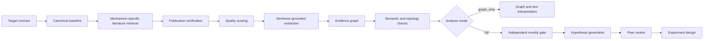
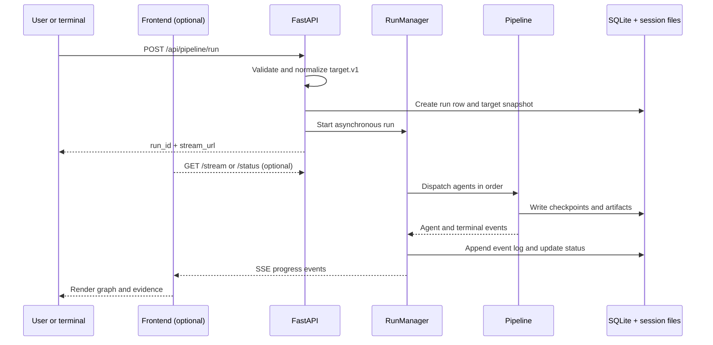

# CausalAtlas Architecture Deep Dive

This document is the current technical and scientific explanation of CausalAtlas. It describes the live pipeline, deterministic fallback path, evidence graph, web application, controls, limitations, and reproducibility expectations.

CausalAtlas is research software. It is not a clinical decision system, therapeutic recommendation engine, or source of medical advice.

## 1. Core design principle

CausalAtlas does not ask a model for one plausible biological story. It builds a traceable evidence object in stages:



The graph is a graph of published evidence, not biological truth. Every biological edge is expected to retain provenance, source references, direction, relation, confidence, evidence strength, and target context.

## 2. Runtime components

### Backend

The FastAPI application in `backend/app/` owns:

- target validation and backward-compatible request handling;
- run creation and SQLite persistence;
- orchestration and SSE progress events;
- PubMed/provider adapters and deterministic local fallback materialization;
- graph construction and graph API responses;
- evidence summaries, replay data, and run-scoped artifacts.

### Agent layer

The orchestrator schedules Agent 1 through Agent 13. The canonical order is in `backend/app/agent_registry.py`; role contracts are in `agents/`.

Agents use least-privilege tools. Agents 1, 2, 10, and 12 require live external lookup/search. Downstream stages normally read upstream JSON artifacts instead of repeatedly searching the web.

### Frontend

The React application in `frontend/` provides run launch, live progress, run-scoped graph selection, display filters, node and edge inspection, exact evidence-sentence excerpts, PMID links, evidence dashboards, and presentation/replay views.

The frontend is an inspection layer. Its filters do not mutate stored graph artifacts.

### Request, persistence, and event flow

For a live run, the control flow is:



SQLite stores operational state: run status, current agent, timestamps, errors, usage counters, human interventions, and append-only progress events. JSON files store scientific state and are organized by run. The separation allows the UI to reconnect to a run without reconstructing scientific artifacts from transient process memory.

The run identifier is the primary isolation boundary. Every artifact, checkpoint, event, graph export, and API response is resolved against that run or its explicit target scope. A retry continues the same run/session and preserves earlier failure events; a new run receives a new identifier and must not overwrite a historical graph.

### Persistent artifacts

```text
data/sessions/<run_id>/       immutable run-scoped pipeline artifacts
data/graphs/<scope>/<run_id>/ immutable graph and graph-analysis artifacts
```

The disease-level latest alias exists for backward compatibility. New runs do not inherit it as their starting graph, so unrelated targets cannot silently look identical.

### What is required to run the system?

The frontend is not required to execute a pipeline. It is a client for the backend and a convenient inspection surface. A run can be launched from a terminal with `curl`, from another HTTP client, or by using the frontend. The backend is required for the normal supported live-run path because it owns orchestration, persistence, provider execution, and SSE events.

There are three supported operating modes:

| Mode | Backend | Frontend | External services | Purpose |
| --- | --- | --- | --- | --- |
| Offline verification | no | no | no | Tests and deterministic checks |
| Terminal/API run | yes | no | PubMed and selected LLM CLI for a live run | Automation, batch work, headless servers |
| Web run and inspection | yes | yes | Same as terminal/API run | Launching, monitoring, filtering, and presenting graphs |

The frontend never owns scientific state. It reads run-scoped API responses and artifacts; closing the browser does not cancel a run. Conversely, starting the frontend alone cannot start a live pipeline unless the backend is also available. The read-only offline and replay routes are the exception: they use embedded snapshots and need neither backend nor external credentials.

The backend can be started from the repository root:

```bash
source backend/.venv/bin/activate
uvicorn app.main:app --app-dir backend --host 127.0.0.1 --port 8000
```

Then a graph-only disease-free run can be launched without the frontend:

```bash
curl -X POST http://127.0.0.1:8000/api/pipeline/run \
  -H 'Content-Type: application/json' \
  --data-raw '{
    "target": {
      "schema_version": "target.v1",
      "disease": null,
      "genes": ["BRAF"],
      "drugs": ["vemurafenib"],
      "tissues": [],
      "cell_types": [],
      "statistical_candidates": [],
      "query_mode": "multidimensional"
    },
    "autonomy_level": "let_it_rip",
    "analysis_mode": "graph_only"
  }'
```

The response contains a `run_id` and `stream_url`. Progress can be observed with the stream endpoint, status can be polled with `/api/pipeline/{run_id}/status`, and final graph artifacts remain under `data/sessions/<run_id>/` and `data/graphs/<scope>/<run_id>/`. This is the supported terminal workflow; importing internal Python functions directly bypasses API validation and is intended for tests, not routine runs.

## 3. Target contract and input modes

The legacy request remains valid:

```json
{
  "disease": "asthma",
  "gene": "IL33"
}
```

The multidimensional target contract is:

```json
{
  "target": {
    "schema_version": "target.v1",
    "disease": "melanoma",
    "genes": ["BRAF"],
    "drugs": ["vemurafenib"],
    "tissues": [],
    "cell_types": [],
    "statistical_candidates": [],
    "query_mode": "multidimensional"
  },
  "analysis_mode": "graph_only",
  "autonomy_level": "let_it_rip"
}
```

### Disease-scoped mode

A disease may be combined with optional genes, drugs, tissues, and cell types. The disease anchors retrieval and relevance scoring. Empty dimensions mean that the user did not ask for that dimension; they are not filled with guessed facts.

### Disease-free gene–drug mode

Disease is optional when both a gene and a drug are supplied:

```json
{
  "target": {
    "schema_version": "target.v1",
    "disease": null,
    "genes": ["BRAF"],
    "drugs": ["vemurafenib"],
    "tissues": [],
    "cell_types": [],
    "statistical_candidates": [],
    "query_mode": "multidimensional"
  }
}
```

Internally, the run is persisted under a technical scope such as `gene_drug_BRAF_vemurafenib`. This scope is used for the database row, run ID, and filesystem path only. It is never inserted into PubMed as if it were a disease and is never written into evidence context as a disease.

Disease-free mode can establish or fail to establish drug–gene and drug–pathway evidence, but it cannot claim disease specificity that was never supplied. A disease-specific conclusion requires a separate disease-scoped run.

The validator rejects a disease-free target unless both `genes` and `drugs` are present.

### Statistical candidate input

An optional `statistical_candidates` record carries an external signal:

```json
{
  "drug": "erlotinib",
  "gene": "EGFR",
  "method": "colocalization",
  "effect": 0.31,
  "p_value": 0.001,
  "q_value": 0.01,
  "source": "study-or-dataset-name",
  "source_id": "optional-record-id"
}
```

This is an input observation, not a PMID claim. The pipeline never converts a statistical signal into a biological edge without literature or canonical provenance.

## 4. Orchestration and agents

### Agent 00 — Orchestrator

Creates the run, writes the target snapshot, loads required skills, and dispatches agents in order. It records progress, checkpoints, pauses, failures, and terminal status. A failed or partial run remains explicit; missing downstream output is not replaced with plausible text.

### Agent 01 — Canonical baseline

Looks up established facts from structured sources such as Reactome, KEGG, UniProt, and MyDisease.info before PMID-derived content exists. Canonical provenance remains separate from PMID provenance. A canonical support link is not automatically a causal PMID edge.

#### Canonical layer in detail

The canonical layer is a read-only, pre-literature scaffold. Its purpose is to provide stable identifiers, curated relationships, entity disambiguation, and established background context before the variable PubMed corpus is built. It is not a replacement for literature retrieval and it is not a claim that every returned database relationship is causal in the submitted disease context.

For a target, Agent 1 queries the four configured structured sources:

| Source | Main contribution | Identifier preserved in the artifact |
| --- | --- | --- |
| Reactome | Human pathways, reactions, participating physical entities, and linked references | Reactome stable ID such as `R-HSA-...` |
| KEGG | Disease/pathway entries and gene/pathway cross-references | KEGG entry ID such as `hsa05310` |
| UniProt | Human protein identity, function, Gene Ontology, pathway and domain annotations | UniProt accession |
| MyDisease.info | Disease normalization, MONDO mappings, HPO, DisGeNET and CTD-associated fields | MONDO or returned source identifier |

The lookup sequence is:

1. Normalize the submitted target and determine which dimensions are populated.
2. Query Reactome and KEGG for disease/pathway context; query UniProt for populated genes; query MyDisease.info for disease identity and associated structured fields.
3. Extract only statements and identifiers returned by those providers.
4. Record every queried source in `sources_queried`, including sources that return zero hits.
5. Store each accepted entry with `provenance_type: "canonical_db"`, source name, real source identifier, statement, nodes, and retrieval/version metadata.
6. Write `canonical_baseline.json` before Agent 2 starts.

The layer has deliberate provider controls. KEGG calls are throttled to at most three requests per second and entry requests are batched up to ten IDs. UniProt queries are field-scoped and batched where possible. MyDisease.info supports batch requests up to 1,000 IDs. Provider release/version metadata is recorded when returned, because canonical databases change over time. No identifier is synthesized when a provider returns no usable record.

Canonical entries have a separate lifecycle from PMID evidence:

```text
canonical database response
        ↓
canonical_baseline.json
        ├── Agent 5: naming and disambiguation context only
        ├── Agent 6: optional canonical overlay, provenance preserved
        └── Agent 10: established-consensus shortcut where protocol allows
```

Agent 5 may use a canonical entry to recognize that `BRAF`, `B-RAF`, and a UniProt-backed protein refer to the same biological role, but it must not relabel a PMID edge as canonical. Agent 6 may display canonical nodes or edges as an overlay, but canonical and PMID evidence remain distinguishable in the graph, API, and UI. Agent 10 may use a canonical match as an established-consensus signal under the novelty protocol; this is not the same as claiming that the current PubMed corpus independently replicated the relationship. If a source is unavailable, the run records reduced canonical coverage rather than filling the gap with guessed biology.

The canonical layer therefore answers: “What curated entities and relationships are already available from these structured databases for this target?” It does not answer: “Does this exact submitted drug–gene–disease mechanism have direct experimental support?” That question is handled by retrieval, verification, extraction, and graph gates.

### Agent 02 — Literature retrieval

Builds a mechanism-specific PubMed corpus instead of using one generic query.

For a disease-scoped gene target, representative strategies are:

```text
gene_disease_direct       EGFR non-small cell lung cancer
gene_context_mechanism    EGFR non-small cell lung cancer mechanism
```

For a disease, gene, and drug:

```text
drug_target_direct        "erlotinib" EGFR (target OR binds OR neutralizes)
drug_target_mechanism     "erlotinib" EGFR (mechanism OR antibody OR pathway)
drug_disease_direct       "erlotinib" "non-small cell lung cancer"
```

For disease-free gene–drug mode:

```text
"BRAF" "vemurafenib"
BRAF mechanism
"vemurafenib" BRAF (target OR binds OR neutralizes)
"vemurafenib" BRAF (mechanism OR antibody OR pathway)
```

Tissue and cell-type strategies are added only when those dimensions are populated. Disease MeSH/fibrosis fallbacks are added only when a disease exists.

#### Retrieval limits and pagination

The normal Agent 2 budget is bounded by:

- maximum query count: 8;
- maximum publications: 120;
- maximum retrieval deadline: 240 seconds.

The local materializer uses bounded PubMed pages and batches metadata fetches. It records the full PubMed hit count separately from the number retrieved. High-hit queries are paginated rather than silently trusting only the first most-recent page.

PMIDs are deduplicated before the corpus is written. A paper found by multiple strategies appears once and retains query metadata.

After the first pass, at most two bounded node-expansion queries may be created. An expansion node must be repeatedly observed, must be outside submitted target dimensions, and must pass the bounded vocabulary policy. The system does not issue one query for every extracted noun.

#### Time balance

Every publication is assigned to a year distribution. The artifact records year groups and `year_band_flag`. A temporally skewed corpus is surfaced as a quality warning rather than silently treated as balanced evidence.

#### Cost controls

For wiring tests, the API accepts `dev_pubmed_retmax`. This is a per-run override for a cheap validation run; it does not modify production defaults or the search skill. `analysis_mode=graph_only` avoids expensive downstream hypothesis stages.

### Agent 03 — Publication verification

Checks that a record has usable metadata and target relevance. The deterministic fallback requires:

- a PMID;
- a title;
- at least one resolved target term in title, abstract, or journal metadata.

Rejection reasons such as `incomplete_metadata` and `target_terms_not_found` are preserved. The full live verification path is stronger than the local metadata-only fallback; the artifact records which scope was used.

Verification means that a publication exists and is usable as evidence input. It does not mean that the publication proves the final biological claim.

### Agent 04 — Quality filter

Scores publications using explicit metadata and limitations:

- publication type and study design;
- species;
- sample size when detectable;
- abstract completeness;
- tissue, cell type, model, and assay context.

Examples of penalties include review rather than primary research, non-human species, in vitro or cell-line-only evidence, unknown species, missing sample size, small sample size, unknown design, and missing abstract.

The result is a quality score and evidence level. It is a structured caution signal, not a formal risk-of-bias review.

### Agent 05 — Mechanistic extraction

Extracts directed statements from abstracts and model output. Each candidate edge should retain a source sentence, PMID, relation, endpoints, node types, species, year, and confidence.

The deterministic drug layer creates a claim only when:

1. the drug occurs in a verified abstract;
2. a PMID is present;
3. the drug and target/pathway occur in the same source sentence;
4. the sentence contains a permitted direct or indirect mechanism cue.

Direct cues include binding, neutralization, antibody blocking, explicit target language, and explicit inhibitor language. Indirect cues include pathway, signaling, downstream, modulation, activation, phosphorylation, and related mechanistic language.

The bounded pathway vocabulary currently includes AMPK, mTOR/mTORC1, PI3K/AKT, MAPK, and NF-kB aliases. An alias is not a claim. An edge is emitted only when a verified PMID sentence supports it.

The same verified corpus also supplies a bounded gene-downstream layer. It currently emits `Gene -> Pathway` edges for the requested gene when all of the following hold:

1. the gene and a pathway alias occur in the same PMID-backed sentence;
2. an explicit directional or causal cue occurs between the two mentions;
3. the wording is not merely a drug-inhibitor statement or a broad list of pathways;
4. the original sentence is retained as provenance.

This is intentionally a cheap deterministic pass over abstracts already retrieved for the run. It performs no additional LLM or PubMed calls and does not infer an unobserved drug effect. A complete mechanistic chain still requires evidence for both `drug -> intermediate` and `intermediate -> queried gene`; a standalone gene-downstream edge is reported as downstream support, not as proof of the complete chain.

### Agent 06 — Graph builder

Combines accepted sentence-grounded edges with provenance. It:

- normalizes safe aliases within a biological role;
- preserves distinct roles such as gene `IL33` versus cytokine/protein `IL-33`;
- merges identical evidence records;
- keeps contradictory directions separate;
- combines direct and indirect drug evidence for the same endpoint into one visual `drug_mechanism` edge with `relation_variants`;
- retains PMID references and source sentences;
- adds canonical database nodes as a separate provenance overlay.

Context fields are normalized before merging so an omitted empty tissue or disease field cannot create a duplicate of the same run.

### Agents 07–09 — Graph analysis

Agent 07 finds loops and feedback structures. Agent 08 calculates topology and ranks architectures. Agent 09 scans for direction-conflicting relations and knowledge gaps. These stages analyze retained evidence; they do not create new biological claims.

### Agents 10–13 — Optional full analysis

These stages are skipped in `graph_only` mode:

- Agent 10 performs independent novelty verification and A–E classification;
- Agent 11 generates hypotheses only for eligible candidates;
- Agent 12 independently peer-reviews candidates;
- Agent 13 designs experiments only after earlier gates allow them.

### Provider execution and deterministic fallback

The normal live path invokes the configured authenticated local LLM CLI (`LLM_PROVIDER=claude` or `LLM_PROVIDER=codex`) for the agents that require model execution. PubMed retrieval and canonical lookups use their respective provider APIs. Agent tool permissions are defined centrally in `backend/app/agent_registry.py`; downstream agents receive only the upstream files and tools needed for their role.

If an LLM CLI cannot start, returns malformed structured output, or produces an unusable artifact, the pipeline does not fabricate a successful model result. It records the failure/fallback metadata and may materialize a bounded deterministic artifact from already retrieved provider data where that fallback is implemented. Such a run exposes `execution_mode: "local_fallback"`, `fallback_agents`, and a usage state of `Not reported` when provider counters are unavailable. It must not be described as an equivalent full live-agent run.

The deterministic path is intentionally conservative:

- it uses verified publications already present in the run;
- it preserves exact source sentences and PMIDs;
- it applies the same graph quality gates before accepting edges;
- it never invents missing canonical identifiers, PMIDs, mechanisms, or usage counters;
- it records partial, failed, or paused states instead of filling missing downstream artifacts with plausible text.

The local fallback currently supports the bounded publication, drug-knowledge, gene-downstream, graph, and quality-materialization paths needed for deterministic verification. Canonical lookup coverage in a fallback run must be read from `canonical_baseline.json` and its coverage note; a fallback note is not evidence that canonical providers were queried successfully.

## 5. The four drug–gene evidence states

Each requested drug–gene pair receives a record in `drug_gene_evidence.json`.

### `candidate_statistical`

An externally supplied statistical signal. It stores method, effect/p-value/q-value, source, and source ID. It is never merged into the PMID causal graph as if it were a published mechanism.

No supplied statistic means `not_provided`, not `not significant` and not `no literature support`.

### `literature_direct`

A direct drug–target claim. In the BRAF showcase, sentences identifying vemurafenib as a BRAF inhibitor support this state. The graph edge retains PMID-backed source sentences.

### `indirect_chain`

A route through a named intermediate protein or pathway. The BRAF showcase produced bounded branches through MAPK, PI3K/AKT, and mTOR.

The strongest chain interpretation is obtained when the graph contains both:

```text
drug → intermediate
intermediate → queried gene
```

If only drug→intermediate is present, it should be described as an indirect pathway association, not a complete causal chain to the gene.

### `no_literature_support`

Active when neither direct target evidence nor an explicit indirect-chain claim passes the gate. It does not mean the relationship is false; it means the current bounded corpus and evidence rules did not find usable support.

A statistical signal may therefore coexist with no literature support. That is a research lead, not a validated mechanism.

## 6. Edge quality gates

The `strict-v2` graph gate requires:

1. a PMID;
2. known source node type;
3. known target node type;
4. an exact source sentence;
5. both endpoints present in that sentence;
6. PMID provenance;
7. demonstrated target relevance;
8. a compatible causal cue for the declared direction when applicable;
9. tissue/cell context when the edge is a tissue/cell claim.

Rejected edges remain in `edge_quality_gate.json` with reasons such as:

```text
missing_pmid
missing_source_sentence
endpoints_not_in_source_sentence
unknown_node_type
non_pmid_provenance
target_relevance_not_demonstrated
causal_direction_not_supported
tissue_cell_context_not_supported
```

The final graph is often much smaller than raw extraction. That reduction is intentional: an unsupported edge is more dangerous than a missing edge in an auditable research graph.

## 7. Graph UI interpretation

### Nodes

Colors and shapes represent normalized entity types: Disease, Gene, Drug, Tissue, Cell type, Cell, Cytokine, Molecule, Pathway, Clinical phenotype, canonical database source, and unresolved type.

Gray/unresolved nodes mean that the entity type was not confidently normalized. Canonical source nodes are provenance overlays, not biological claims merely because they are visible.

### Edges

Selecting an edge displays:

- source and target;
- relation and relation variants;
- evidence state;
- confidence and evidence strength;
- PMID count and sample PMID links;
- run/context metadata;
- up to five exact supporting sentences.

For drug edges, `drug_mechanism` is a display grouping. The underlying variants still distinguish `binds_target` from `indirectly_modulates`.

The UI also shows the drug–gene state strip from graph metadata.

### Display filters

Filters cover entity type, provenance, likely-noise heuristic nodes, input-only target dimensions, and unresolved-type nodes. These are display-only; source artifacts are unchanged.

## 8. Cost and run settings

### `analysis_mode`

`graph_only` is the recommended exploratory mode. It completes retrieval, verification, quality scoring, extraction, graph construction, semantic validation, topology, contradictions, gaps, and text interpretation. `full` additionally runs novelty, hypothesis, peer-review, and experiment stages.

### `autonomy_level`

- `let_it_rip`: run without approval pauses;
- `supervised`: pause at designated checkpoints;
- `autocomplete`: pause after every agent.

### Development retrieval override

`dev_pubmed_retmax` reduces retrieval size for wiring tests. A small-corpus run must not be presented as comprehensive evidence.

### Environment and launch prerequisites

Offline tests do not require provider credentials. A live literature run requires network access to the configured literature and canonical providers. A live agent run additionally requires an authenticated local `claude` or `codex` CLI and a repository-level `.env` with the selected provider, for example:

```text
LLM_PROVIDER=codex
```

Credentials stay outside the frontend bundle and are never placed in the repository. The backend loads `.env` at startup. Before launching a live run, verify:

```bash
curl http://127.0.0.1:8000/api/health
```

The health response reports the selected provider and registered pipeline agents, but a healthy API does not prove that the external CLI is authenticated. A terminal/API run and a web run use the same backend and the same persistence path; the frontend changes observation and control, not scientific processing.

## 9. Run artifacts

| Artifact | Purpose |
| --- | --- |
| `analysis_target.json` | Immutable submitted and normalized target |
| `canonical_baseline.json` | Structured canonical source scaffold |
| `publications_raw.json` | Retrieved corpus, query metadata, hit counts, year balance |
| `publications_verified.json` | Papers surviving metadata/relevance verification |
| `verification_report.json` | Accepted/rejected publication reasons |
| `quality_scores.json` | Study design, species, context, penalties, confidence |
| `mechanisms_extracted.json` | Raw sentence-grounded extracted edges |
| `drug_knowledge.json` | Drug claims and PMID-backed drug layer |
| `drug_gene_evidence.json` | Four-state drug–gene evidence records |
| `edge_quality_gate.json` | Accepted/rejected edge decisions |
| `knowledge_graph.json` | Merged evidence graph |
| `contradictions.json` | Directional conflicts |
| `knowledge_gaps.json` | Weak or missing bridges |
| `network_metrics.json` | Topology and architecture metrics |
| `novelty_audit.json` | Independent A–E checks in full mode |
| `hypotheses.json` | Hypotheses, if gates allow them |
| `peer_review.json` | Independent challenge |
| `experiment_design.json` | Controls, readouts, predictions, falsification |

## 10. Scientific limitations

The system can produce a graph that is technically auditable but biologically incomplete. Important limitations include:

- an abstract may mention a drug and gene in resistance or comparison context;
- PMID count measures supporting records, not independent causal replication;
- a pathway mention does not prove a complete multi-edge chain;
- disease-free mode cannot establish disease specificity;
- quality scoring is a structured heuristic, not a formal risk-of-bias review;
- canonical coverage depends on provider response and version;
- a small or temporally skewed corpus should be reported as degraded/underpowered;
- deterministic fallback verification is weaker than the full live agent path;
- statistical association, biological mechanism, therapeutic efficacy, and clinical usefulness are different claims.

The safe interpretation is: “These are the provenance-backed relationships that passed this run’s retrieval and evidence gates,” not “the graph is complete biological truth.”

## 11. Recommended demonstration

Use:

```text
Target: melanoma
Gene: BRAF
Drug: vemurafenib
Mode: graph_only
```

The showcase demonstrates:

```text
vemurafenib ── direct / drug_mechanism ── BRAF
vemurafenib ── indirect_chain ────────── MAPK
vemurafenib ── indirect_chain ────────── PI3K/AKT
vemurafenib ── indirect_chain ────────── mTOR
```

Then repeat with disease blank. Explain that the second run can inspect drug–gene biology without claiming melanoma specificity.

Before presenting a run, record:

- exact run ID;
- commit SHA;
- analysis mode and autonomy level;
- retrieved and verified publication counts;
- year-band warning;
- graph node and edge counts;
- direct/indirect/no-literature states;
- evidence-quality status;
- whether fallback materialization was used.

See [REPRODUCIBILITY.md](REPRODUCIBILITY.md) for the offline tests, frontend checks, API health check, and read-only replay procedure.
